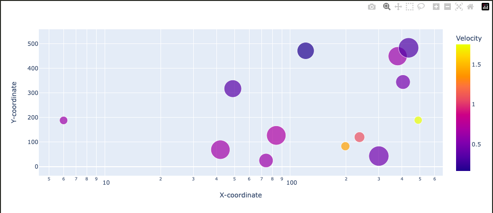

# N-body simulation using Dash
### Interactive Visualisation and Simulation of Gravitational Pull Between Astronomical Bodies Using Dash

Particle and object simulations play an important role in understanding complex phenomena in physics, such as the dynamics of celestial objects and galaxy formation. Visualising these simulations interactively enables better insight into the physical properties and relationships of astrophysical bodies. This approach is a model that offers interactive visualisation through a timeline showing the different stages from start to gravitational equilibrium. It initialises the simulation with random positions and masses of objects, and uses an optimisation strategy to calculate the positions with the lowest potential gravitational energy. 

It is made using a lightweight Dash-based scatter plot, that simulates the objects in a two-dimensional plane, and shows the gravitational relationships between objects, allowing for exploratory data analysis through interactivity. The colours are based on velocity, and the sizes on the mass. The results are an easy-to-understand simulation, that allows for exploration of simplified astrophysical systems, and therefore providing an educational tool and a foundation for more advanced simulations. This contribution advances accessible visualisation tools in astrophysics and shows the use-cases of optimisation strategies in astrophysical research.

A full report has been written about this project inculding workflow, calculations and results. You can find it here: https://www.overleaf.com/read/wgrsbyvqyfjq#91a335
